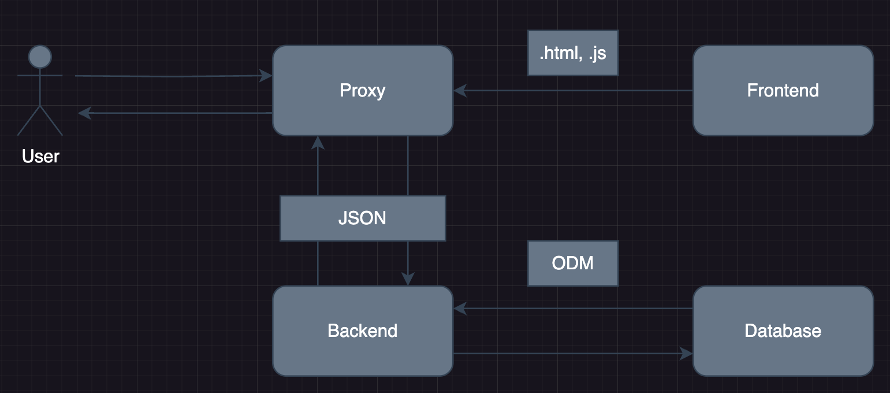
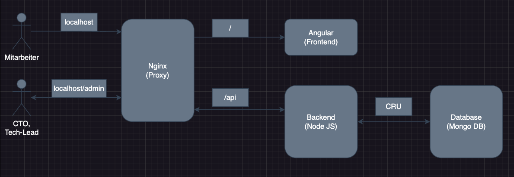
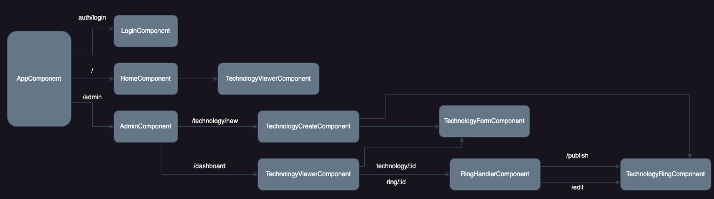
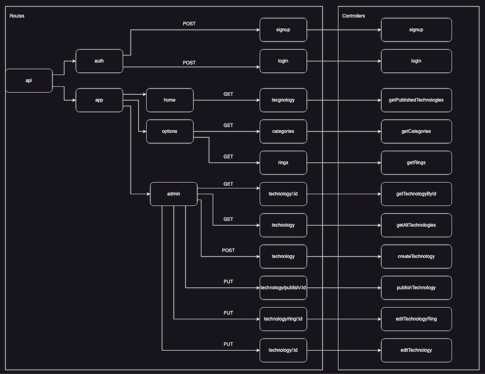
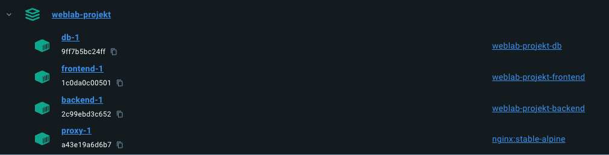

# Web Programming Lab Projekt - Technology Radar
[](https://github.com/Ceredavide/WEBLAB-PROJEKT/actions/workflows/frontend.yml) [](https://github.com/Ceredavide/WEBLAB-PROJEKT/actions/workflows/backend.yml)
### Davide Ceresa - HSLU - HS23

<!-- Jest Coverage Comment: jest-coverage-comment -->

[Screenshots](./screenshots/README.md)


# 1. Einführung und Ziele


Im Rahmen des Kurses Web Programming Lab (WEBLAB) wurden wir ermutigt, unser Wissen über Webentwicklung durch die Arbeit an einem praktischen Projekt zu vertiefen. Das ausgewählte Projekt betrifft die Entwicklung eines "Technologie-Radars", einer strategischen Ressource zur Optimierung des Technologiemanagements in Unternehmen. Dieses Tool ermöglicht es Mitarbeitern, Tech-Leads und dem CTO, Technologien effektiv zu bewerten und auszuwählen. Es bietet einen in vier Hauptkategorien gegliederten Überblick: Techniken, Werkzeuge, Plattformen, Sprachen und Frameworks. Ausserdem klassifiziert es den Technologiereifegrad in die Stufen Evaluieren, Testen, Übernehmen und Beibehalten, um eine fundierte Entscheidungsfindung zu unterstützen. Die Entwicklung dieses Projekts mit JavaScript/TypeScript-Technologien ermöglichte es uns, das im Kurs Gelernte direkt anzuwenden und praktische Erfahrungen bei der Implementierung solch komplexer Systeme zu sammeln.

## 1.1 Aufgabenstellung

Das Projekt, welches als Einzelaufgabe konzipiert ist, soll innerhalb von 60 Stunden abgeschlossen werden. Die Bewertung erfolgt nach spezifischen Kriterien, die verschiedene Aspekte des Projekts berücksichtigen und seine umfassende Qualität sicherstellen:

**Projekt-Ergebnisse:**
- Architekturdokumentation: 35%
- Fazit & Reflexion: 20%
- Arbeitsjournal: 10%
- Softwareartefakte: 35%

**Präsentation:**
- Aufbau, Verständlichkeit: 30%
- Präsentationsartefakte: 30% (Abgabe nach der Präsentation, Inhalt für 5 Minuten)
- Einhaltung der Timebox von 5 Minuten: 10%
- Beantwortung von Fragen: 30%

## 1.2 Qualitätsziele

- **Security:** Der Radar soll sowohl für Mitarbeiter (User) verfügbar sein. Inhalte können nur von spezifischen Rollen (CTO, Tech-Lead, Admin) nach - Authentifizierung mit E-Mail und Passwort verändert werden. Sensible Daten, wie das Passwort, werden nur gehashed abgespeichert.
- **Traceability:** Anpassungen an den Technologien werden historisiert und Anmeldungen auf der Adminseite protokolliert.
- **Performance:** Die Inhalte werden unter Normalbedingungen innert 1s geladen.
- **Usability:** Das UI ist für die Geräte Mobile und Desktop optimiert, sprich es wird auf Responsive-Design gesetzt. Verwendet wird ein schlichtes und übersichtliches Design mit auf der Plattform erwartbarem Verhalten.

# 2. Kontextabgrenzung

## 2.1 User Stories

Die Anforderungen wurden zu Beginn des Projekts bekannt gegeben und durch User Stories geteilt. Unter [diesem Link](https://github.com/web-programming-lab/web-programming-lab-projekt/blob/main/Technologie-Radar.md) finden Sie die detaillierten Spezifikationen.

| Nummer | User Story                                | Priorität | Link                                                             |
| ------ | ----------------------------------------- | --------- | ---------------------------------------------------------------- |
| 1      | Anmelden Technologie-Radar-Administration | Could     | [Issue 1](https://github.com/Ceredavide/WEBLAB-PROJEKT/issues/1) |
| 2      | Technologie erfassen                      | Must      | [Issue 2](https://github.com/Ceredavide/WEBLAB-PROJEKT/issues/2) |
| 3      | Technologie publizieren                   | Should    | [Issue 3](https://github.com/Ceredavide/WEBLAB-PROJEKT/issues/3) |
| 4      | Technologie ändern                        | Should    | [Issue 4](https://github.com/Ceredavide/WEBLAB-PROJEKT/issues/4) |
| 5      | Technologie-Einordnung ändern             | Should    | [Issue 5](https://github.com/Ceredavide/WEBLAB-PROJEKT/issues/5) |
| 6      | Anmelden am Technologie-Radar-Viewer      | Could     | [Issue 6](https://github.com/Ceredavide/WEBLAB-PROJEKT/issues/6) |
| 7      | Technologien anzeigen                     | Must      | [Issue 7](https://github.com/Ceredavide/WEBLAB-PROJEKT/issues/7) |

## 2.2 Milestones

Die User Stories wurden anschliessend in Milestones hinzugefügt, welche den Abschluss der User Stories nach Priorität beschrieben.

| Nummer | Milestones                   | Priorität | Link                                                                    |
| ------ | ---------------------------- | --------- | ----------------------------------------------------------------------- |
| 1      | Foundation of the Radar      | Must      | [Milestone 1](https://github.com/Ceredavide/WEBLAB-PROJEKT/milestone/1) |
| 2      | Optimization and Publication | Should    | [Milestone 2](https://github.com/Ceredavide/WEBLAB-PROJEKT/milestone/2) |
| 3      | Expansion and Accessibility  | Could     | [Milestone 3](https://github.com/Ceredavide/WEBLAB-PROJEKT/milestone/3) |
| 4      | Refinement and Launch        | Could     | [Milestone 4](https://github.com/Ceredavide/WEBLAB-PROJEKT/milestone/4) |

## 2.3 Technischer Kontext

Der technische Kontext des Systems basiert auf einer Client-Server-Architektur. Benutzer interagieren mit dem System über eine Frontend-Komponente, die HTML und JavaScript verwendet. Anfragen werden durch einen Proxy geleitet, der als Zwischenschicht für Sicherheit und Datenmanagement dient. Die Kommunikation zwischen dem Frontend und dem Backend erfolgt über JSON. Das Backend verarbeitet die Anfragen, interagiert über ein Objektdatenmodell (ODM) mit der Datenbank und führt die Geschäftslogik aus.



# 3. Lösungsstrategie

## 3.1 Technologieentscheidungen

### 3.1.1 Frontend - [Angular](https://angular.io/)
Die Wahl von Angular als unserem Hauptframework basiert auf seiner Reife und dem umfangreichen Ökosystem, unterstützt von Google, was Zuverlässigkeit und eine Fülle von Ressourcen sicherstellt. Seine komponentenbasierte Architektur fördert Skalierbarkeit und Modularität, ideal für die Handhabung komplexer Projekte. Darüber hinaus gewährleistet die robuste Community von Angular kontinuierliche Unterstützung, was es zum bestgeeigneten Framework für die effiziente Entwicklung unseres Projekts macht.

#### 3.1.1.1 CSS / UI - [Tailwind CSS](https://tailwindcss.com/) / [Flowbite](https://flowbite.com/)
Die Entscheidung für Tailwind CSS basiert auf seiner Anpassungsfähigkeit und Effizienz durch Utility-first-Klassen. Die aktive Community und umfangreiche Dokumentation erleichtern schnelle, flexible Designanpassungen, was die Entwicklungsarbeit vereinfacht.

Die Auswahl von Flowbite beruht auf seiner nahtlosen Integration mit Tailwind CSS, was die Erstellung von interaktiven UI-Komponenten vereinfacht. Die unterstützende Community und die reichhaltige Bibliothek fördern eine schnelle und effiziente Entwicklung.

### 3.1.2 Backend - [Node Js](https://nodejs.org/en)
Die Entscheidung für Node.js als Backend basiert auf seiner Leistungsfähigkeit und Effizienz bei der Handhabung asynchroner Anfragen, seiner breiten Unterstützung durch eine aktive Community und der Möglichkeit, JavaScript sowohl auf dem Server als auch auf dem Client zu verwenden, was die Entwicklung vereinfacht.

#### 3.1.2.1 API - [Express](https://expressjs.com/)
Die Wahl von Express für API-Aufrufe basiert auf seiner Einfachheit und Effizienz, ideal für die schnelle Entwicklung von RESTful APIs. Seine minimalistische Herangehensweise und die starke Community-Unterstützung erleichtern die Implementierung und Wartung, optimieren den Entwicklungsprozess.

#### 3.1.2.2 ODM - [Mongoose](https://mongoosejs.com/)
Die Entscheidung für Mongoose ergibt sich aus seiner Fähigkeit, eine strukturierte Datenmodellierung für MongoDB zu bieten, was die Entwicklung von datenintensiven Anwendungen vereinfacht. Die Bibliothek ermöglicht eine einfache Handhabung von Schemata und bietet eingebaute Validierungsfunktionen, was den Aufwand für die Datenverwaltung reduziert. Zudem unterstützt die umfangreiche Dokumentation und die aktive Community schnelle Lösungsfindungen und effiziente Entwicklungsmethoden.

#### 3.1.2.3 Authentication - [JsonWebToken](https://www.npmjs.com/package/jsonwebtoken)
Die Entscheidung für JsonWebToken (JWT) basiert auf seiner Fähigkeit, sichere, tokenbasierte Authentifizierung und Informationsaustausch zwischen Parteien zu ermöglichen. JWT bietet eine kompakte und selbstenthaltene Methode zur sicheren Übermittlung von Informationen als JSON-Objekte, was besonders nützlich für die Erstellung von stateless API-Services ist. Diese Methode vereinfacht die Implementierung von Authentifizierungsmechanismen, verbessert die Sicherheit und ermöglicht eine effiziente Überprüfung und Datenübertragung zwischen Client und Server.

#### 3.1.2.4 Hashing - [Bcrypt](https://www.npmjs.com/package/bcrypt)
Die Integration von bcrypt in unser System dient der Gewährleistung höchster Sicherheitsstandards bei der Passwortverarbeitung. Bcrypt, eine bewährte Hashing-Funktion, bietet robusten Schutz gegen Angriffe durch seine Salting- und Hashing-Mechanismen, die Passwörter auch vor zukünftigen Bedrohungen effektiv schützen. Diese Technologie ermöglicht es uns, Benutzerdaten sicher zu speichern und zu verifizieren, ohne Kompromisse bei der Leistung einzugehen, und unterstützt unsere Bemühungen um die Sicherheit der Benutzerinformationen.

### 3.1.3 Database - [Mongo DB](https://www.mongodb.com/)
Die Wahl von MongoDB als Datenbanksystem beruht auf seiner Flexibilität bei der Datenspeicherung, seiner Skalierbarkeit und der Unterstützung durch eine starke Community, die eine schnelle Entwicklung ermöglicht.

### 3.1.4 Proxy - [Nginx](https://www.nginx.com/)
NGINX ist eine ausgezeichnete Wahl als Proxy wegen seiner Leistungsfähigkeit und Flexibilität. Er kann Tausende von Verbindungen gleichzeitig effizient verarbeiten, was ihn ideal für hochfrequentierte Websites macht. Seine Konfiguration ist anpassbar, was die Einrichtung vereinfacht. Zudem ist NGINX für seine Zuverlässigkeit bekannt und unterstützt eine Vielzahl von Protokollen, was ihn zu einer vielseitigen Lösung macht.

### 3.1.5 Deployment - [Docker](https://www.docker.com/)
Die Wahl von Docker für unsere Infrastruktur spiegelt das Bestreben wider, Entwicklung und Deployment zu vereinfachen und zu standardisieren. Docker ermöglicht es uns, Anwendungen in Containern zu isolieren, wodurch die Konsistenz über verschiedene Umgebungen und Plattformen hinweg gewährleistet wird. Diese Isolierung verbessert die Sicherheit und ermöglicht eine schnelle, skalierbare Bereitstellung von Anwendungen. Zudem fördert Dockers umfangreiche Ökosystem und Community die Effizienz und Flexibilität unserer Entwicklungsprozesse, indem es eine breite Palette an Werkzeugen und best practices zur Verfügung stellt.

## 3.2 Persönliche Überlegungen
In meiner Erfahrung als Webentwickler habe ich stets mit React.js als Frontend-Technologie gearbeitet und mich für das CSS/UI-Design auf Bootstrap verlassen. Die grösste Herausforderung bestand darin, die Best Practices und die korrekte Anwendung von Angular während des Projekts zu erlernen. Ähnliches galt für Tailwind und Flowbite: Anfangs hielt ich den Einsatz von Letzterem nicht für notwendig, doch im Verlauf des Projekts wurde mir klar, dass es sehr zeitaufwendig war, eine visuell ansprechende und gleichzeitig responsive Benutzeroberfläche zu erstellen. Deshalb entschied ich mich, die Komponenten von Flowbite zu nutzen und bei Bedarf anzupassen.

In Bezug auf Backend und Datenbank habe ich bereits Erfahrungen mit diesen Technologien gesammelt und fand ihre Implementierung stets zufriedenstellend.

# 4. Bausteinsicht



## 4.1 Frontend
Dieses Schema zeigt die Struktur einer Frontend-Anwendung. Im Mittelpunkt steht die `AppComponent`, von der verschiedene Routen zu spezifischen Komponenten führen. Die `LoginComponent` ist für die Benutzerauthentifizierung zuständig, während die `HomeComponent` die Startseite repräsentiert. Die `AdminComponent` bietet Zugang zu Verwaltungsfunktionen und über eine weitere Route ist eine `Dashboard`-Ansicht mit einem zusätzlichen `TechnologyViewerComponent` erreichbar.

Für die Technologieverwaltung gibt es spezielle Routen: `technology/new` führt zum `TechnologyCreateComponent` für das Erstellen neuer Technologieeinträge. Mit `technology/:id` und `ring/:id` können bestehende Technologien über ihre IDs verwaltet werden. Die Komponenten `TechnologyFormComponent` und `TechnologyRingComponent` sind für das Erstellen, Veröffentlichen und Bearbeiten von Technologieinformationen vorgesehen.



## 4.1 Backend

Das vorliegende Bild zeigt ein Backend-Routenschema einer Webanwendung. Es gibt eine Haupt-API-Route, die in mehrere Unterpfade aufgeteilt ist:

- `auth`: Enthält POST-Methoden für `signup` und `login`, die jeweils an die entsprechenden Controller anknüpfen.
- `app`: Diese Route verzweigt sich weiter in:
   - `home`: Eine GET-Methode, die `getPublishedTechnologies` aufruft.
   - `options`: Unter dieser Route gibt es zwei GET-Methoden für `categories` und `rings`, die zu `getCategories` bzw. `getRings` führen.
- `admin`: Eine Route, die für administrative Zwecke verwendet wird und mehrere Methoden umfasst:
   - GET für `technology/:id` und `technology`, die zu `getTechnologyById` bzw. `getAllTechnologies` führen.
   - POST, PUT und weitere PUT-Methoden für `technology`, `technology/publish/:id` und `technology/ring/:id`, die auf die Controller `createTechnology`, `publishTechnology` und `editTechnologyRing` zugreifen.
   - Eine zusätzliche PUT-Methode für `technology/:id` ist vorhanden, um Technologiedaten zu bearbeiten (`editTechnology`).



# 5. Verteilungssicht

Bevor Sie mit der Installation fortfahren, stellen Sie sicher, dass die Ports `80` und `27017` Ihres Geräts derzeit nicht in Gebrauch sind.

Das Produktionssystem wird mittels Docker Compose bereitgestellt. Im Folgenden finden Sie die Befehlen, um das Projekt zu starten:

### 5.1 Download Projekt- und variable Steuer .env
```console
foo@bar:~$ git clone https://github.com/Ceredavide/Technology-Radar.git
foo@bar:~$ cd Technology-Radar/backend
foo@bar:~$ mv example.env .env
```

Hier muss der Variablen JWT_SECRET ein Wert zugewiesen werden.

### 5.2 Container mit Docker Compose starten
```console
foo@bar:~$ cd ..
foo@bar:~$ docker-compose up
```

Die Installation und Konfiguration der zugehörigen Container wird gestartet; der Vorgang kann einige Minuten in Anspruch nehmen, um abgeschlossen zu werden. Wenn die Konfiguration erfolgreich abgeschlossen wurde, sollte das Ergebnis dem in der folgenden Abbildung dargestellten ähneln.



An diesem Punkt können Sie auf die Anwendung zugreifen, indem Sie die folgende URL in Ihren Browser eingeben:

```console
http://localhost/
```

Während der Installation in der Produktionsumgebung werden die Tabellen `Users` und `Technologies` befüllt; weitere Operationen sind für das ordnungsgemässe Funktionieren der Anwendung nicht erforderlich. Im Folgenden sind die Benutzer aufgelistet, die bei der Konfiguration vorhanden sind:

| email           | password | role                     |
| --------------- | -------- | ------------------------ |
| alice@hslu.ch   | CTO      | Chief Technology Officer |
| bob@hslu.ch     | TechLead | Tech Lead                |
| charlie@hslu.ch | Employee | Employee                 |

Das System kann jederzeit durch Ausführen des folgenden Befehls gestoppt werden:

```console
foo@bar:~$ docker-compose down
```

# 6. Qualitätsanforderungen

Die Qualitätsanforderungen wurden im Kapitel 1.2 Qualitätsziele definiert.

# 7. Risiken und technische Schulden

| Titel           | Beschreibung                                                                                                                                                 | Art        | Geschätzter Aufwand |
| --------------- | ------------------------------------------------------------------------------------------------------------------------------------------------------------ | ---------- | ------------------- |
| Error Handling  | Korrekte Anzeige von Fehlern aus dem Backend in Formularen                                                                                                   | Fix        | 2h                  |
| User Management | Möglichkeit für Nutzer, sich zu registrieren und ihre Registrierung bestätigen oder ablehnen zu lassen; bestätigte Nutzer können auf die Anwendung zugreifen | Feat       | 8h                  |
|                 |                                                                                                                                                              | **Total:** | **10h**             |

# 8. Reflektion

Das Projekt für das WEBLAB-Modul hat sich als äusserst positive und lehrreiche Erfahrung erwiesen. Die Möglichkeit, die im Laufe meines Studiums erlernte Theorie praktisch anzuwenden, bot mir eine wertvolle Gelegenheit, über meinen Ansatz zur Entwicklung von Anwendungen kritisch nachzudenken.

Mit einer gewissen Enttäuschung musste ich feststellen, dass alte Gewohnheiten, die meine Effizienz in der Entwicklung beeinträchtigen, weiterhin bestehen. Insbesondere wurde mir die Bedeutung einer intensiveren Planungsphase zu Beginn des Projekts bewusst, sowohl im Hinblick auf die Architektur des Backends als auch des Frontends. Diese Lücke manifestierte sich im Laufe des Projekts in der Notwendigkeit, bestimmte Teile der Anwendung mehrfach zu überarbeiten, nachdem ich mich zu voreilig in die Entwicklung neuer Funktionen gestürzt hatte. Dies führte zu einem Zyklus aus Versuch und Irrtum, der nicht nur frustrierend war, sondern auch zeitintensiv. Eine bessere Anfangsorganisation hätte definitiv einen Unterschied gemacht.

Ein weiterer wichtiger Aspekt, der sich herauskristallisierte, war die Bedeutung der Aufteilung der Stories und der Erstellung kleinerer, handhabbarer Issues. Die Entscheidung, für jede User Story ein einzelnes Issue anzulegen, erschwerte letztlich den Entwicklungsprozess, was in einer hohen Anzahl von Commits resultierte, die oft nur wenig miteinander zu tun hatten und die Arbeit unnötig erschwerten.

Das Projekt hielt jedoch auch positive Überraschungen bereit, darunter die Entdeckung von Angular. Obwohl ich ein überzeugter Nutzer von React und React Native war, aufgrund ihrer Vielseitigkeit und der Lebendigkeit ihrer Community, wurde ich angenehm von den Möglichkeiten überrascht, die Angular in der Frontend-Entwicklung bietet. Besonders schätzte ich den geringeren Bedarf an externen Bibliotheken im Vergleich zu React und die von Angular geförderte strukturierte Herangehensweise. Dies verbesserte die Qualität meiner Arbeit weiter, auch dank der Suche nach Best Practices im Internet und der effektiven Nutzung der CLI zur Generierung von Komponenten und Diensten, die mir eine solide Grundlage für den Code bot.

Andererseits hat meine geringere Vertrautheit mit Angular den bereits erwähnten Zyklus aus Versuch und Irrtum intensiviert, insbesondere beim Überarbeiten von Komponenten wie Formularen, während ich neue Funktionen des Frameworks entdeckte, die es mir ermöglichten, meinen Code zu optimieren. Diese Situation, kombiniert mit Mängeln in der anfänglichen Organisationsphase, führte zu häufigen Refactoring- und Änderungsphasen.

Abschliessend war dieser Kurs und das damit verbundene Projekt eine äusserst lohnende Erfahrung. Obwohl mir bewusst wurde, dass ich noch einen langen Lernweg vor mir habe, bot mir dieser Weg eine klarere Sicht auf meine Fähigkeiten und die Bereiche, in denen ich mich verbessern muss. Ich werde diese Erfahrung sicherlich meinen Kommilitonen empfehlen, da sie in vielerlei Hinsicht bereichernd ist.

# 9. Arbeitsjournal

| Datum         | Aufwand | Titel                                                                              | Beschreibung                                                                                                                                                                                                                                                                                                                                                                                                                                                                                                                                                                                                                                                                                                                                                                                                                                                                               |
| ------------- | ------- | ---------------------------------------------------------------------------------- | ------------------------------------------------------------------------------------------------------------------------------------------------------------------------------------------------------------------------------------------------------------------------------------------------------------------------------------------------------------------------------------------------------------------------------------------------------------------------------------------------------------------------------------------------------------------------------------------------------------------------------------------------------------------------------------------------------------------------------------------------------------------------------------------------------------------------------------------------------------------------------------------ |
| Mo. 05.02.204 | 1h      | Technologie-Recherche, GitHub Repository                                           | Zu Beginn des Projekts führte ich eine gründliche Untersuchung der Technologien durch, die ich nutzen möchte, indem ich deren offizielle Webseiten (aufgeführt in Kapitel 3.1) besichtigte, um ihre Eignung für meine Bedürfnisse zu bestätigen. Daraufhin erstellte ich ein Repository auf GitHub, wo ich gezielt Ordner für das Backend und das Frontend anlegte und eine Erstkonfiguration durchführte. Zum Abschluss fügte ich die deutsche Version der arc42-Vorlage hinzu, um eine strukturierte Dokumentation und Architekturübersicht zu gewährleisten.                                                                                                                                                                                                                                                                                                                            |
| Di. 06.02.204 | 1h      | Projektbeschreibungsdokument                                                       | Heute habe ich das Dokument bezüglich der Projektbeschreibung verfasst, in dem ich meinen persönlichen Hintergrund als Webentwickler, den Technologie-Stack, den ich für das Projekt einsetzen möchte, sowie zusätzliche User Stories beschreibe.                                                                                                                                                                                                                                                                                                                                                                                                                                                                                                                                                                                                                                          |
| Mi. 07.02.204 | 1h      | Erstellung von Issues und Milestones, DB-Schema Skizze, Arbeit am Backend begonnen | Heute habe ich mich damit beschäftigt, Issues und Milestones auf GitHub einzurichten, um die Arbeitsbranches anhängen zu können und einen besseren Überblick über den Fortschritt des Projekts zu haben. Ich begann, über die Struktur der Projektelemente nachzudenken, und schliesslich habe ich eine Testroute im Backend erstellt, um deren korrekte Funktionsweise zu überprüfen.                                                                                                                                                                                                                                                                                                                                                                                                                                                                                                     |
| Do. 08.02.204 | 3h      | Backend-Workflow der Erfassungstechnologie                                         | Heute widmete ich mich der Entwicklung der Backend-Logik für die Einführung einer neuen Technologie. Dabei erstellte ich zunächst das `TechnologyModel` mit Mongoose, um eine solide Datenstruktur zu gewährleisten. Anschliessend definierte ich mittels Express sorgfältig Routen, um die HTTP-Anfragen effizient zu bearbeiten, die für diesen Prozess relevant sind. Zum Abschluss führte ich umfassende Tests durch, um sicherzustellen, dass die Implementierung fehlerfrei funktioniert und die gesetzten Erwartungen erfüllt.                                                                                                                                                                                                                                                                                                                                                      |
| Mo. 12.02.204 | 4h      | Frontend-Workflow der Erfassungstechnologie, Backend-Options-API                   | Heute konzentrierte ich mich auf die Implementierung eines Angular-Formulars, das in der Lage ist, mit dem zuvor erstellten Backend zu interagieren. Ich erstellte die Komponente `TechnologyForm` und einen Service, der nach dem korrekten Ausfüllen des Formulars den HTTP-POST-Aufruf durchführt. Zusätzlich musste ich im Backend APIs implementieren, um die verschiedenen Optionen für Kategorien und Ringe abzurufen. Ausserdem korrigierte ich einen Fehler im Zusammenhang mit CORS, um eine reibungslose Kommunikation zwischen Frontend und Backend zu gewährleisten. Schliesslich führte ich Tests durch, um die einwandfreie Funktionalität des Komponenten und der APIs sicherzustellen.                                                                                                                                                                                    |
| Di. 13.02.204 | 3h      | Backend-Authentifizierung                                                          | Nach reiflicher Überlegung habe ich beschlossen, die Authentifizierung jetzt zu implementieren, obwohl es eine Aufgabe war, die für später geplant war. Die getroffene Entscheidung stellte ein Dilemma dar: Laut der aktuell bearbeiteten User Story (Nr. 2) sollte nur der Administrator in der Lage sein, eine Technologie zu erstellen, was bedeutet, dass die Authentifizierung bereits vorhanden sein muss. Daher entschied ich mich, vorauszuplanen, indem ich die Routen für die Authentifizierung einrichtete, das `UserModel` erstellte und JWT sowie bcrypt installierte, um eine sichere und effektive Authentifizierungsumgebung zu schaffen.                                                                                                                                                                                                                                 |
| Mi. 15.02.204 | 5h      | Frontend-Authentifizierung, Tests                                                  | Heute habe ich mich mit der Implementierung der Authentifizierung auf der Frontend-Seite beschäftigt. Dies erforderte die Erstellung der Komponenten für Login und Signup sowie deren zugehörige Dienste. Des Weiteren implementierte ich einen `JWTInterceptor`, der dafür verantwortlich ist, das JWT an jede zukünftige Anfrage anzuhängen. Schliesslich setzte ich einen `AuthGuard` ein, eine Funktion, die überprüft, ob ein Benutzer authentifiziert ist, und ihn, falls nicht, zur Login-Seite umleitet, um die Sicherheit und den Zugriffsschutz innerhalb der Anwendung zu gewährleisten. Darüber hinaus habe ich mich vergewissert, dass die Authentifizierung sowohl auf der Frontend- als auch auf der Backend-Seite gründlich getestet wurde, um eine nahtlose und sichere Benutzererfahrung zu garantieren.                                                                 |
| Mo. 19.02.204 | 6h      | Technologie-Anzeige, Technology-Viewer                                             | Heute habe ich mich ganz der User Story zur Visualisierung gewidmet. Anschliessend habe ich die im Backend benötigte Route zur Rückgabe der veröffentlichten Technologien hinzugefügt und die Komponente zur Visualisierung dieser Technologien implementiert. Die Arbeit am Frontend war besonders herausfordernd: Ich wollte eine responsive Komponente erstellen, die untergeordnete Komponenten verwendet, um die Kategorie- und Ring-Tabs sowie die Anzeige der Technologien zu verwalten. Um dies zu erreichen, folgte ich einem [Tutorial](https://www.youtube.com/watch?v=n3ZXOhWg74w), um zu verstehen, wie man ein Tab-System in Angular mit EventEmitter implementiert. Nach der Feinabstimmung jedes einzelnen Details führte ich Tests durch, um sicherzustellen, dass alles richtig funktionierte und dem Benutzer eine reibungslose und intuitive Navigation geboten wurde. |
| Di. 20.02.204 | 2h      | Struktur der Frontend-Ordner, Verbesserungen am Technologie-Viewer                 | Nach verschiedenen Recherchen, um eine bessere Ordnerstruktur für das Frontend zu finden, entschied ich mich, den in einem [Blogpost](https://www.devbyseb.com/article/best-practices-for-angular-app-development-folder-structure-naming-lazy-loading-and-more) gefundenen Praktiken zu folgen. Daraufhin habe ich begonnen, die Ordnerstruktur meines Frontends umzugestalten. Zusätzlich bemühte ich mich, die Komponente TechnologyViewer wiederverwendbar zu gestalten, sodass sie sowohl für die Ansicht durch normale Benutzer als auch durch Benutzer mit administrativen Rechten genutzt werden kann.                                                                                                                                                                                                                                                                             |
| Do. 22.02.204 | 4h      | Refactor, Styling                                                                  | Heute konzentrierte ich mich darauf, den Stil des Projekts zu überarbeiten, insbesondere stellte ich sicher, dass alle bisher erstellten Seiten auch auf mobilen Geräten nutzbar sind. Darüber hinaus bemühte ich mich, die Interfaces und Types von TypeScript im gesamten Projekt besser zu implementieren, indem ich `any` durch die korrekten Interfaces oder Typen ersetzte.                                                                                                                                                                                                                                                                                                                                                                                                                                                                                                          |
| Fr. 23.02.204 | 8h      | Technologie-Publizieren, Technology-Card                                           | Heute habe ich mich darauf konzentriert, den Prozess der Veröffentlichung einer Technologie sowie die Ansicht der Technologien durch einen Administrator zu entwickeln. Der Zeitaufwand resultierte aus einer vollständigen Überarbeitung der Nutzung von Formularen: Ich entschied mich dafür, die Formulare zu eigenständigen Komponenten zu machen und sie durch Handler-Komponenten zu verwalten. Darüber hinaus habe ich Felder in der Ansicht der Technologie durch einen administrativen Benutzer hinzugefügt, um die an den Technologien durchgeführten Operationen nachverfolgen zu können.                                                                                                                                                                                                                                                                                       |
| Sa. 24.02.204 | 8h      | Technologie-Einordnung Ändern, Dokumentation                                       | Heute habe ich den Teil implementiert, der mit der Änderung des Rings einer Technologie verbunden ist. Dank der zuvor eingeführten Struktur mit den Handlern war dieser Prozess einfach zu implementieren. Ich habe auch damit begonnen, die Dokumentation zu schreiben, basierend auf Schemata und Skizzen, die ich zuvor während der Entwicklung der Anwendung angefertigt hatte.                                                                                                                                                                                                                                                                                                                                                                                                                                                                                                        |
| So. 25.02.204 | 6h      | Technologie-Ändern, Technology-Erfassen mit Stepper, Dokumentation                 | Heute habe ich dieselbe Operation, die ich am Formular für die Ringe durchgeführt habe, am Formular für die Technologie umgesetzt: Ich habe es zu einer unabhängigen Komponente gemacht, die nur dafür zuständig ist, Daten zu empfangen und zu validieren, um dann die Submit-Operation an eine Handler-Komponente weiterzugeben. Dies hat mir ermöglicht, den Workflow zur Änderung einer Technologie mit derselben Logik umzusetzen, die ich zuvor bei den Ringen verwendet habe. Nach diesen Änderungen musste jedoch das ursprüngliche Formular zur Erstellung der Technologien neu gemacht werden: Ich habe diese Komponente neu erstellt und einen Handler implementiert, der die beiden Formulare nacheinander verwaltet, indem ich die Logik eines Steppers implementierte. Darüber hinaus habe ich mit der Dokumentation weitere Fortschritte gemacht.                           |
| Mo. 26.02.204 | 3h      | Admin-Dashboard-Anmelden, More Guards                                              | Heute habe ich mich damit beschäftigt, die notwendigen Links zum Navigationsmenü hinzuzufügen, damit der Zugang zum Administrations-Dashboard möglich ist, sofern der Benutzer die entsprechenden Berechtigungen hat. Zusätzlich habe ich eine Karte zum Navigationsmenü hinzugefügt, die die Informationen des angemeldeten Benutzers anzeigt, zusammen mit einer Abmelde-Schaltfläche. Schliesslich habe ich zwei Schutzmechanismen hinzugefügt, um den Zugang zu den Seiten des Projekts robuster zu gestalten (`IsLoggedGuard`, verhindert, dass ein bereits authentifizierter Benutzer auf die Login-/Anmeldeseiten zugreifen kann; `AdminRoleGuard`, überprüft, ob ein Benutzer die Berechtigungen hat, um auf die Administrationsseiten zuzugreifen).                                                                                                                               |
| Di. 27.02.204 | 3h      | Deployment, Refactor, Style                                                        | Heute konzentrierte ich mich darauf, die letzten grafischen Fehler in der mobilen Version zu korrigieren. Anschliessend setzte ich mit dem Deployment-Test des Projekts fort, indem ich einem [Tutorial](https://www.docker.com/blog/containerizing-an-event-posting-app-built-with-the-mean-stack/) folgte. Dies führte zu Änderungen verschiedener URLs zwischen Backend und Frontend.                                                                                                                                                                                                                                                                                                                                                                                                                                                                                                   |
| Mi. 28.02.204 | 4h      | Dokumentation & Abgabe                                                             | Heute habe ich mich darauf konzentriert, die Dokumentation und das Arbeitsjournal abzuschliessen. Ich habe die Datenbank mit Technologien gefüllt und nochmals überprüft, dass alles funktioniert und bereit für die Abgabe ist.                                                                                                                                                                                                                                                                                                                                                                                                                                                                                                                                                                                                                                                           | v |
| **Total:**    | **63h** |                                                                                    |                                                                                                                                                                                                                                                                                                                                                                                                                                                                                                                                                                                                                                                                                                                                                                                                                                                                                            |

**Über arc42**

arc42, das Template zur Dokumentation von Software- und
Systemarchitekturen.

Template Version 8.2 DE. (basiert auf AsciiDoc Version), Januar 2023

Created, maintained and © by Dr. Peter Hruschka, Dr. Gernot Starke and
contributors. Siehe <https://arc42.org>.
